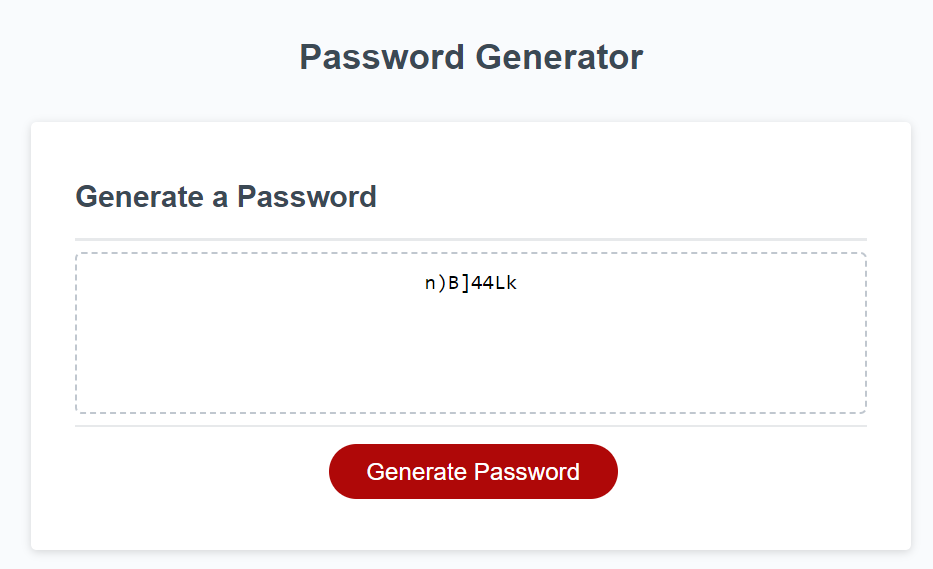

# PasswordGenerator
A unique password generator tool

## Description

The app generates a random password when the button is clicked
  
## Technologies Used
HTML5
JavaScript (ES6)
Git
GitHub
Visual Studio Code

## Installation

N/A

## Usage

The app generates a random password when the button is clicked
* Fill in a series of prompts for password criteria
    * Length of password
      * At least 8 characters but no more than 128.
    * Character types
      * Lowercase
      * Uppercase
      * Numeric
      * Special characters ($@%&*, etc)
    * Once prompts are answered then the password is generated and displayed

The app is at the following URL:

https://jobmoonday.github.io/PasswordGenerator/

## Screenshots of the app

 

## Credits

N/A

## License

Please refer to the LICENCE in the repo.
